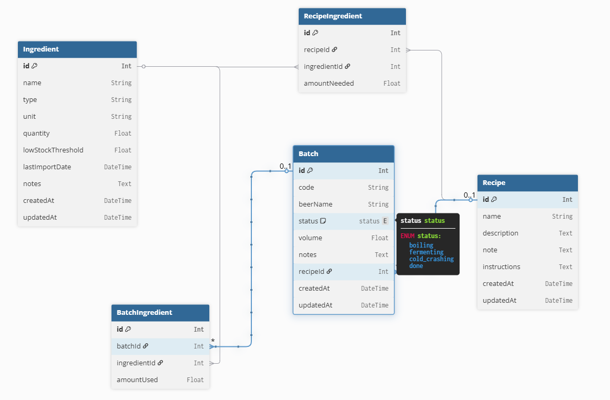

## 🍺 Brewing Manager – Thiết kế Cơ Sở Dữ Liệu (ERD)
> Phiên bản đầu tiên của hệ thống quản lý bia thủ công: quản lý nguyên liệu, mẻ nấu, công thức, và lịch sử sản xuất.

### 🧩 1. Sơ Đồ ERD (Entity Relationship Diagram)
🔗 Xem sơ đồ tại:
👉 [Brewing Manager](https://dbdiagram.io/d/brewing_manager-68712f8df413ba3508768e59)

___

### 📦 2. Bảng `Ingredient`
| Trường              | Kiểu dữ liệu | Mô tả                                       |
| ------------------- | ------------ | ------------------------------------------- |
| `id`                | Int (PK)     | Mã nguyên liệu tự tăng                      |
| `name`              | String       | Tên nguyên liệu (VD: Cascade, Pilsner Malt) |
| `type`              | String       | Loại: `malt`, `hop`, `yeast`, `other`       |
| `unit`              | String       | Đơn vị tính (VD: `kg`, `g`, `gói`)          |
| `quantity`          | Float        | Số lượng hiện có trong kho                  |
| `lowStockThreshold` | Float        | Ngưỡng cảnh báo khi gần hết                 |
| `lastImportDate`    | DateTime     | Ngày nhập kho gần nhất                      |
| `notes`             | Text         | Ghi chú bổ sung nếu có                      |
| `createdAt`         | DateTime     | Ngày tạo bản ghi                            |
| `updatedAt`         | DateTime     | Ngày cập nhật cuối cùng                     |

**✅ Mối quan hệ:**

- Dùng trong nhiều mẻ (BatchIngredient)

- Thuộc nhiều công thức (RecipeIngredient)
___

### 🍺 3. Bảng `Batch`

| Trường      | Kiểu dữ liệu | Mô tả                                                        |
| ----------- | ------------ | ------------------------------------------------------------ |
| `id`        | Int (PK)     | Mã định danh mẻ                                              |
| `code`      | String       | Mã mẻ định danh (VD: B001, B002)                             |
| `beerName`  | String       | Tên loại bia được nấu                                        |
| `status`    | Enum         | Trạng thái: `boiling`, `fermenting`, `cold_crashing`, `done` |
| `volume`    | Float        | Dung tích nấu (VD: 60 lít)                                   |
| `notes`     | Text         | Ghi chú quy trình, hương vị, đặc điểm riêng                  |
| `recipeId`  | Int (FK)     | Công thức được sử dụng (liên kết tới bảng `Recipe`)          |
| `createdAt` | DateTime     | Ngày tạo mẻ                                                  |
| `updatedAt` | DateTime     | Ngày cập nhật cuối cùng                                      |

**✅ Mối quan hệ:**

- Gồm nhiều nguyên liệu (BatchIngredient)

- Có thể dựa theo một công thức (Recipe)

___

### 🧮 4. Bảng `BatchIngredient`
| Trường         | Kiểu dữ liệu | Mô tả                                |
| -------------- | ------------ | ------------------------------------ |
| `id`           | Int (PK)     | Mã dòng ghi nhận nguyên liệu sử dụng |
| `batchId`      | Int (FK)     | FK → bảng `Batch`                    |
| `ingredientId` | Int (FK)     | FK → bảng `Ingredient`               |
| `amountUsed`   | Float        | Lượng nguyên liệu đã dùng trong mẻ   |

**✅ Mối quan hệ:**

- Là bảng trung gian N:N giữa Batch và Ingredient
___

### 📘 5. Bảng `Recipe`
| Trường         | Kiểu dữ liệu | Mô tả                                      |
| -------------- | ------------ | ------------------------------------------ |
| `id`           | Int (PK)     | Mã công thức                               |
| `name`         | String       | Tên công thức (VD: IPA cổ điển, Stout đậm) |
| `description`  | Text         | Mô tả chung về công thức                   |
| `note`         | Text         | Ghi chú kỹ thuật                           |
| `instructions` | Text         | Hướng dẫn quy trình từng bước              |
| `createdAt`    | DateTime     | Ngày tạo công thức                         |
| `updatedAt`    | DateTime     | Ngày chỉnh sửa gần nhất                    |

**✅ Mối quan hệ:**

- Gồm nhiều nguyên liệu (RecipeIngredient)

- Có thể được áp dụng cho mẻ (Batch)
___

### 🧂 6. Bảng RecipeIngredient
| Trường         | Kiểu dữ liệu | Mô tả                                       |
| -------------- | ------------ | ------------------------------------------- |
| `id`           | Int (PK)     | Mã dòng ghi nhận định lượng                 |
| `recipeId`     | Int (FK)     | FK → bảng `Recipe`                          |
| `ingredientId` | Int (FK)     | FK → bảng `Ingredient`                      |
| `amountNeeded` | Float        | Lượng nguyên liệu cần thiết trong công thức |

**✅ Mối quan hệ:**

- Là bảng trung gian N:N giữa Recipe và Ingredient